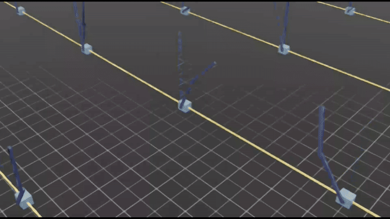
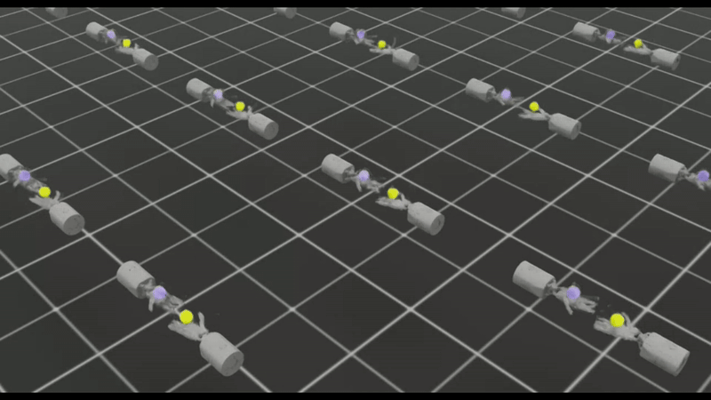

# RewMARL
This repo implements mutualistic reward shaping in multi-agent reinforcement learning (MARL) to enhance robot cooperation. Tested on CartPendulum, ShadowHand, and Mobile Manipulation, it improves stability, convergence, and coordination. Includes code, results, and documentation. Contributions welcome! 🚀

This repository contains code for Investigating Symbiosis in Robotic Ecosystems: A Case Study for Multi-Robot Reinforcement Learning Reward Shaping.

Code is available now!

## ⚙️ Installation & Usage

This project has been tested on **Ubuntu 22.04** using **Isaac Sim 4.5.0** or **4.2.0**.

### ✅ Prerequisites

Install Isaac Sim and IsaacLab by following the [IsaacLab pip installation guide](https://isaac-sim.github.io/IsaacLab/main/source/setup/installation/pip_installation.html).

Make sure the following files are placed correctly:
```
IsaacLab/
├── source/
│   ├── isaaclab_assets/
│   │   └── isaaclab_assets/
│   │       └── robots/
│   │           └── mobile_franka.py
│   └── isaaclab_tasks/
│       └── isaaclab_tasks/
│           └── direct/
│               ├── cart_pendulum/
│               ├── shadow_hand/
│               └── mobile_franka/
```

### 🚀 Example: Training MobileFranka

To train the **MobileFranka** multi-agent task using MAPPO:

```bash
./isaaclab.sh -p scripts/reinforcement_learning/skrl/train.py --algorithm MAPPO --task=MobileFrankaMARL #--headless
```

## Example Environments

| CartPendulum | ShadowHand | MobileFranka |
|:---:|:---:|:---:|
|  |  |  |
| **Cooperative Balancing:** Multiple agents control different aspects of the double cart-pendulum system, requiring coordinated actions to maintain balance. | **Shadow Hand Object Passing:** Multiple agents controlling different finger groups of the dexterous hand, collaborating through shared rewards to manipulate and pass objects with precision. | **Mobile Manipulation:** Combining base movement and arm control agents that benefit from shared reward signals to perform coordinated navigation and manipulation tasks. |

## Key Features
- **Bio-Inspired Reward Shaping**: Implements a formal symbiosis model to enhance cooperation in MARL.
- **Symbiotic Interaction Taxonomy**: Categorizes agent interactions as mutualism, commensalism, and parasitism.
- **Improved Learning in Complex Tasks**: Enhances stability, convergence, and variance reduction in high-dimensional environments.

## 🧠 Citation

If you use this code or find the idea useful, please consider citing our work:
```
@inproceedings{niu2025symbiosis,
  title={Investigating Symbiosis in Robotic Ecosystems: A Case Study for Multi-Robot Reinforcement Learning Reward Shaping},
  author    = {Xuezhi Niu and Didem Gürdür Broo},
  booktitle = {the 2025 9th International Conference on Robotics and Automation Sciences (ICRAS)},
  year      = {2025},
  publisher = {IEEE}
}
```

